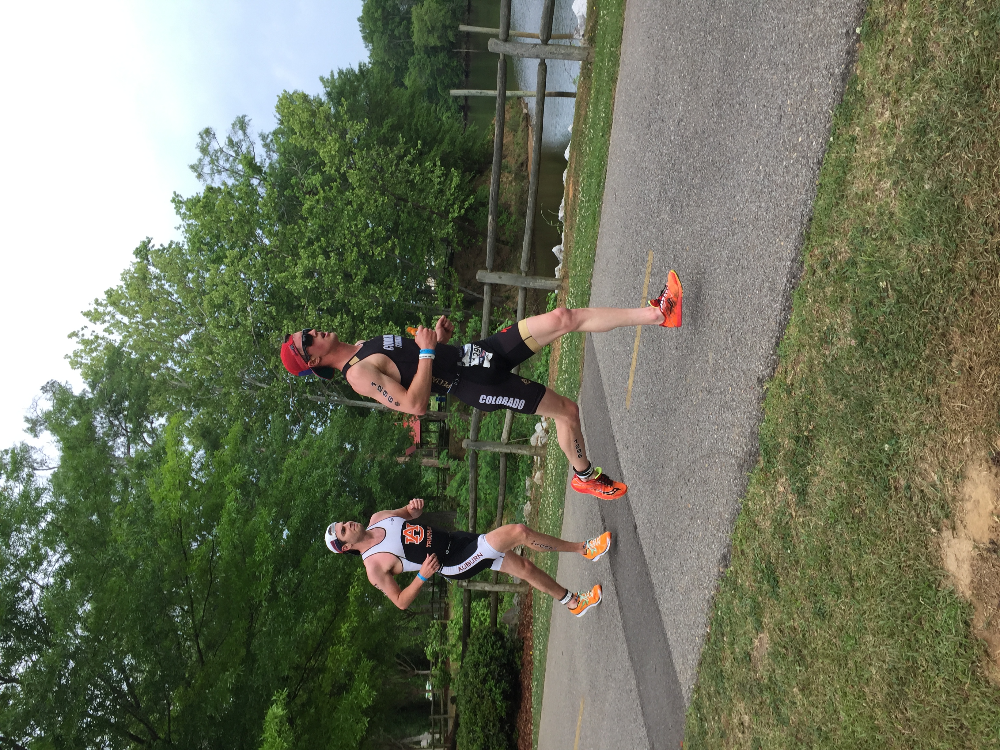

# knit
## Summary
I aim to create a web application that helps runners improve their form, so that they can reduce the risk of injury and increase their speed and efficiency. The central feature of this web application will allow users to upload a video of themselves running for analysis. From the uploaded video, the central feature will analyze a user's running form, make comparisons to existing models of elite runners, and display these comparisons in an easy to view report format.

## Resources:
https://www.valentinog.com/blog/redux/#react-redux-tutorial-getting-to-know-redux-reducers

https://docs.djangoproject.com/en/3.0/intro/tutorial01/

https://djoser.readthedocs.io/en/latest/getting_started.html